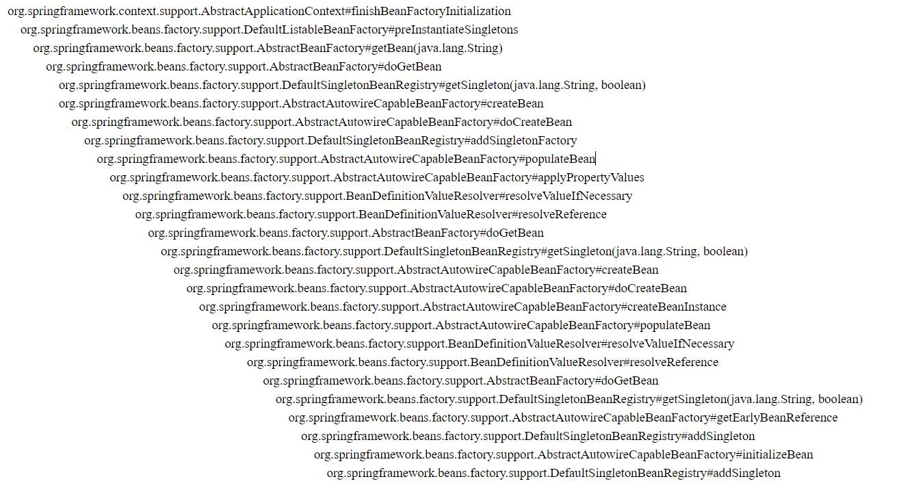
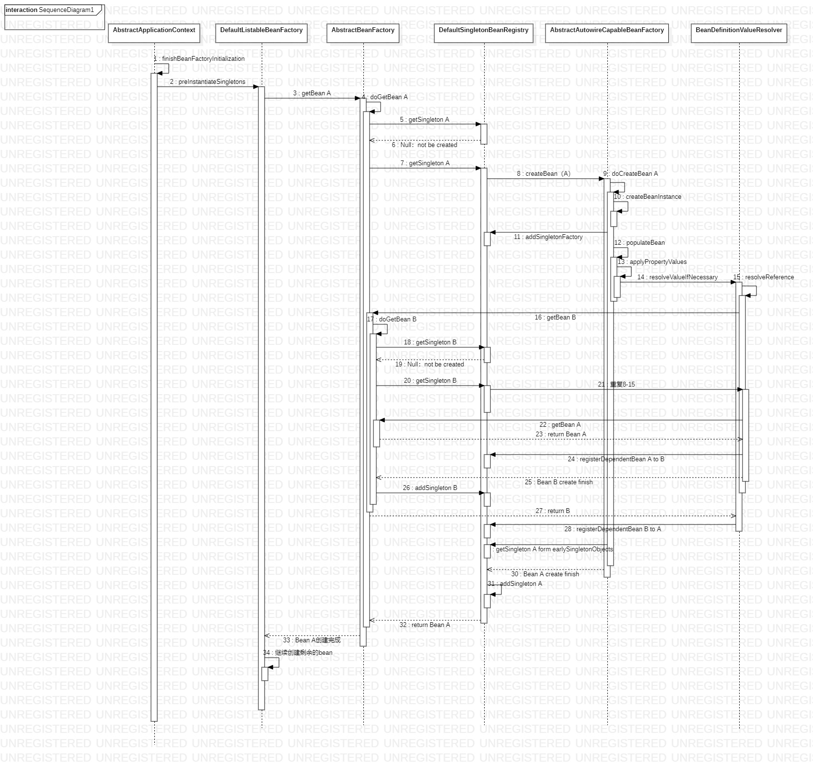

**代码调用关系**

**时序图**

	1. 实例化所有单例bean
	2. 实例化所有立即加载的单例bean
	3. 实例化当前bean A
	4. 调用doGetBean方法实例化当前bean A
	5. 尝试从缓存中获取 bean A
	6. 此时bean A还未被创建，缓存中不存在，返回null
	7. 进入创建流程
	8. 开始创建一个当前bean A的实例
	9. 真真正正创建bean A
	10. 创建 Bean A 实例，仅仅调用构造方法，但是尚未设置属性
	11. 判断当前bean A是否需要提前暴露出去，如果需要，则将其加入到三级缓存中
	12. 进行Bean A属性填充
	13. 开始填充属性
	14. 属性填充
	15. 处理依赖的引用类型的属性值
	16. 获取依赖的Bean B
	17. 调用doGetBean方法实例化依赖的bean B
	18. 尝试从缓存中获取 bean B
	19. 此时 bean B 还未被创建，缓存中不存在，返回null
	20. 进入创建bean B的流程
	21. 重复流程8-15，在这个过程中，Bean B也被加入到三级缓存中
	22. 获取Bean B 依赖的 Bean A
	23. 尝试从缓存中获取 bean A，此时在三级缓存中找到Bean A，将其取出放入二级缓存中，并返回给getBean
	24. 将Bean A注入到 Bean B
	25. 继续执行Bean B的实例化过程，最终实例化完成
	26. 将实例化完成的Bean B 放入单例池，从三级缓存中移除
	27. 将Bean B 返回
	28. 将Bean B 注入到Bean A中
	29. 从二级缓存中取出Bean A，继续完成Bean A 的创建
	30. Bean A 实例创建完成
	31. 将创建完的Bean A放入单例池，并从二级缓存移除
	32. 返回创建完成的Bean A
	33. Bean A的创建流程完成
	34. 继续创建并实例化剩余的bean
	
	

